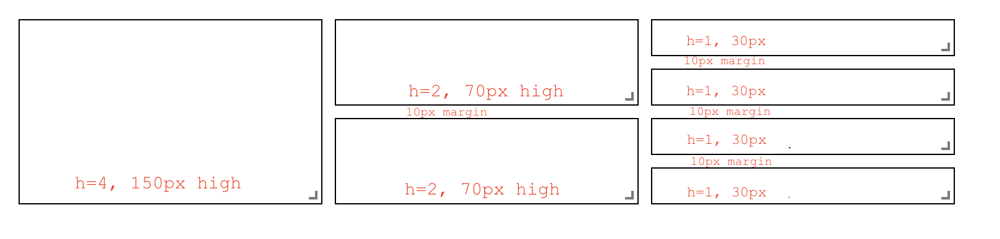

# React-Grid-Layout

[](https://travis-ci.org/STRML/react-grid-layout)
[](https://cdnjs.com/libraries/react-grid-layout)
[](https://www.npmjs.org/package/react-grid-layout)
[]()

React-Grid-Layout is a grid layout system much like [Packery](http://packery.metafizzy.co/) or
[Gridster](http://dsmorse.github.io/gridster.js/), for React.

Unlike those systems, it is responsive and supports breakpoints. Breakpoint layouts can be provided by the user
or autogenerated.

RGL is React-only and does not require jQuery.


> GIF from production usage on [BitMEX.com](https://www.bitmex.com)

[**[Demo](https://react-grid-layout.github.io/react-grid-layout/) | [Changelog](/CHANGELOG.md) | [CodeSandbox Editable demo](https://codesandbox.io/s/5wy3rz5z1x?module=%2Fsrc%2FShowcaseLayout.js)**]

## Table of Contents

- [Demos](#demos)
- [Features](#features)
- [Installation](#installation)
- [Usage](#usage)
- [Responsive Usage](#responsive-usage)
- [Providing Grid Width](#providing-grid-width)
- [Grid Layout Props](#grid-layout-props)
- [Responsive Grid Layout Props](#responsive-grid-layout-props)
- [Grid Item Props](#grid-item-props)
- [User Recipes](../../wiki/Users-recipes)
- [Performance](#performance)
- [Contribute](#contribute)
- [TODO List](#todo-list)

## Demos

1. [Showcase](https://react-grid-layout.github.io/react-grid-layout/examples/00-showcase.html)
1. [Basic](https://react-grid-layout.github.io/react-grid-layout/examples/01-basic.html)
1. [No Dragging/Resizing (Layout Only)](https://react-grid-layout.github.io/react-grid-layout/examples/02-no-dragging.html)
1. [Messy Layout Autocorrect](https://react-grid-layout.github.io/react-grid-layout/examples/03-messy.html)
1. [Layout Defined on Children](https://react-grid-layout.github.io/react-grid-layout/examples/04-grid-property.html)
1. [Static Elements](https://react-grid-layout.github.io/react-grid-layout/examples/05-static-elements.html)
1. [Adding/Removing Elements](https://react-grid-layout.github.io/react-grid-layout/examples/06-dynamic-add-remove.html)
1. [Saving Layout to LocalStorage](https://react-grid-layout.github.io/react-grid-layout/examples/07-localstorage.html)
1. [Saving a Responsive Layout to LocalStorage](https://react-grid-layout.github.io/react-grid-layout/examples/08-localstorage-responsive.html)
1. [Minimum and Maximum Width/Height](https://react-grid-layout.github.io/react-grid-layout/examples/09-min-max-wh.html)
1. [Dynamic Minimum and Maximum Width/Height](https://react-grid-layout.github.io/react-grid-layout/examples/10-dynamic-min-max-wh.html)
1. [No Vertical Compacting (Free Movement)](https://react-grid-layout.github.io/react-grid-layout/examples/11-no-vertical-compact.html)
1. [Prevent Collision](https://react-grid-layout.github.io/react-grid-layout/examples/12-prevent-collision.html)
1. [Error Case](https://react-grid-layout.github.io/react-grid-layout/examples/13-error-case.html)
1. [Toolbox](https://react-grid-layout.github.io/react-grid-layout/examples/14-toolbox.html)
1. [Drag From Outside](https://react-grid-layout.github.io/react-grid-layout/examples/15-drag-from-outside.html)
1. [Bounded Layout](https://react-grid-layout.github.io/react-grid-layout/examples/16-bounded.html)
1. [Responsive Bootstrap-style Layout](https://react-grid-layout.github.io/react-grid-layout/examples/17-responsive-bootstrap-style.html)
1. [Scaled Containers](https://react-grid-layout.github.io/react-grid-layout/examples/18-scale.html)
1. [Allow Overlap](https://react-grid-layout.github.io/react-grid-layout/examples/19-allow-overlap.html)
1. [All Resizable Handles](https://react-grid-layout.github.io/react-grid-layout/examples/20-resizable-handles.html)
1. [Single Row Horizontal](https://react-grid-layout.github.io/react-grid-layout/examples/21-horizontal.html)

#### Projects Using React-Grid-Layout

- [Basedash](https://www.basedash.com)
- [BitMEX](https://www.bitmex.com/)
- [AWS CloudFront Dashboards](https://aws.amazon.com/blogs/aws/cloudwatch-dashboards-create-use-customized-metrics-views/)
- [Grafana](https://grafana.com/)
- [Metabase](http://www.metabase.com/)
- [HubSpot](http://www.hubspot.com)
- [ComNetViz](http://www.grotto-networking.com/ComNetViz/ComNetViz.html)
- [Stoplight](https://app.stoplight.io)
- [Reflect](https://reflect.io)
- [ez-Dashing](https://github.com/ylacaute/ez-Dashing)
- [Kibana](https://www.elastic.co/products/kibana)
- [Graphext](https://graphext.com/)
- [Monday](https://support.monday.com/hc/en-us/articles/360002187819-What-are-the-Dashboards-)
- [Quadency](https://quadency.com/)
- [Hakkiri](https://www.hakkiri.io)
- [Ubidots](https://help.ubidots.com/en/articles/2400308-create-dashboards-and-widgets)
- [Statsout](https://statsout.com/)
- [Datto RMM](https://www.datto.com/uk/products/rmm/)
- [SquaredUp](https://squaredup.com/)

_Know of others? Create a PR to let me know!_

## Features

- 100% React - no jQuery
- Compatible with server-rendered apps
- Draggable widgets
- Resizable widgets
- Static widgets
- Configurable packing: horizontal, vertical, or off
- Bounds checking for dragging and resizing
- Widgets may be added or removed without rebuilding grid
- Layout can be serialized and restored
- Responsive breakpoints
- Separate layouts per responsive breakpoint
- Grid Items placed using CSS Transforms
  - Performance with CSS Transforms: [on](http://i.imgur.com/FTogpLp.jpg) / [off](http://i.imgur.com/gOveMm8.jpg), note paint (green) as % of time
- Compatibility with `<React.StrictMode>`

| Version      | Compatibility   |
| ------------ | --------------- |
| >= 0.17.0    | React 16 & 17   |
| >= 0.11.3    | React 0.14 & 15 |
| >= 0.10.0    | React 0.14      |
| 0.8. - 0.9.2 | React 0.13      |
| < 0.8        | React 0.12      |

## Installation

Install the React-Grid-Layout [package](https://www.npmjs.org/package/react-grid-layout) using [npm](https://www.npmjs.com/):

```bash
npm install react-grid-layout
```

Include the following stylesheets in your application:

```
/node_modules/react-grid-layout/css/styles.css
/node_modules/react-resizable/css/styles.css
```

## Usage

Use ReactGridLayout like any other component. The following example below will
produce a grid with three items where:

- users will not be able to drag or resize item `a`
- item `b` will be restricted to a minimum width of 2 grid blocks and a maximum width of 4 grid blocks
- users will be able to freely drag and resize item `c`

```js
import GridLayout from "react-grid-layout";

class MyFirstGrid extends React.Component {
  render() {
    // layout is an array of objects, see the demo for more complete usage
    const layout = [
      { i: "a", x: 0, y: 0, w: 1, h: 2, static: true },
      { i: "b", x: 1, y: 0, w: 3, h: 2, minW: 2, maxW: 4 },
      { i: "c", x: 4, y: 0, w: 1, h: 2 }
    ];
    return (
      <GridLayout
        className="layout"
        layout={layout}
        cols={12}
        rowHeight={30}
        width={1200}
      >
        <div key="a">a</div>
        <div key="b">b</div>
        <div key="c">c</div>
      </GridLayout>
    );
  }
}
```

You may also choose to set layout properties directly on the children:

```js
import GridLayout from "react-grid-layout";

class MyFirstGrid extends React.Component {
  render() {
    return (
      <GridLayout className="layout" cols={12} rowHeight={30} width={1200}>
        <div key="a" data-grid={{ x: 0, y: 0, w: 1, h: 2, static: true }}>
          a
        </div>
        <div key="b" data-grid={{ x: 1, y: 0, w: 3, h: 2, minW: 2, maxW: 4 }}>
          b
        </div>
        <div key="c" data-grid={{ x: 4, y: 0, w: 1, h: 2 }}>
          c
        </div>
      </GridLayout>
    );
  }
}
```

### Usage without Browserify/Webpack

A module usable in a `<script>` tag is included [here](/dist/react-grid-layout.min.js). It uses a UMD shim and
excludes `React`, so it must be otherwise available in your application, either via RequireJS or on `window.React`.

### Responsive Usage

To make RGL responsive, use the `<ResponsiveReactGridLayout>` element:

```js
import { Responsive as ResponsiveGridLayout } from "react-grid-layout";

class MyResponsiveGrid extends React.Component {
  render() {
    // {lg: layout1, md: layout2, ...}
    const layouts = getLayoutsFromSomewhere();
    return (
      <ResponsiveGridLayout
        className="layout"
        layouts={layouts}
        breakpoints={{ lg: 1200, md: 996, sm: 768, xs: 480, xxs: 0 }}
        cols={{ lg: 12, md: 10, sm: 6, xs: 4, xxs: 2 }}
      >
        <div key="1">1</div>
        <div key="2">2</div>
        <div key="3">3</div>
      </ResponsiveGridLayout>
    );
  }
}
```

When in responsive mode, you should supply at least one breakpoint via the `layouts` property.

When using `layouts`, it is best to supply as many breakpoints as possible, especially the largest one.
If the largest is provided, RGL will attempt to interpolate the rest.

You will also need to provide a `width`, when using `<ResponsiveReactGridLayout>` it is suggested you use the HOC
`WidthProvider` as per the instructions below.

It is possible to supply default mappings via the `data-grid` property on individual
items, so that they would be taken into account within layout interpolation.

### Providing Grid Width

Both `<ResponsiveReactGridLayout>` and `<ReactGridLayout>` take `width` to calculate
positions on drag events. In simple cases a HOC `WidthProvider` can be used to automatically determine
width upon initialization and window resize events.

```js
import { Responsive, WidthProvider } from "react-grid-layout";

const ResponsiveGridLayout = WidthProvider(Responsive);

class MyResponsiveGrid extends React.Component {
  render() {
    // {lg: layout1, md: layout2, ...}
    var layouts = getLayoutsFromSomewhere();
    return (
      <ResponsiveGridLayout
        className="layout"
        layouts={layouts}
        breakpoints={{ lg: 1200, md: 996, sm: 768, xs: 480, xxs: 0 }}
        cols={{ lg: 12, md: 10, sm: 6, xs: 4, xxs: 2 }}
      >
        <div key="1">1</div>
        <div key="2">2</div>
        <div key="3">3</div>
      </ResponsiveGridLayout>
    );
  }
}
```

This allows you to easily replace `WidthProvider` with your own Provider HOC if you need more sophisticated logic.

`WidthProvider` accepts a single prop, `measureBeforeMount`. If `true`, `WidthProvider` will measure the
container's width before mounting children. Use this if you'd like to completely eliminate any resizing animation
on application/component mount.

Have a more complicated layout? `WidthProvider` [is very simple](/lib/components/WidthProvider.jsx) and only
listens to window `'resize'` events. If you need more power and flexibility, try the
[SizeMe React HOC](https://github.com/ctrlplusb/react-sizeme) as an alternative to WidthProvider.

### Grid Layout Props

RGL supports the following properties (see the source for the final word on this):

```js
//
// Basic props
//

// This allows setting the initial width on the server side.
// This is required unless using the HOC <WidthProvider> or similar
width: number,

// If true, the container height swells and contracts to fit contents
autoSize: ?boolean = true,

// Number of columns in this layout.
cols: ?number = 12,

// A CSS selector for tags that will not be draggable.
// For example: draggableCancel:'.MyNonDraggableAreaClassName'
// If you forget the leading . it will not work.
// .react-resizable-handle" is always prepended to this value.
draggableCancel: ?string = '',

// A CSS selector for tags that will act as the draggable handle.
// For example: draggableHandle:'.MyDragHandleClassName'
// If you forget the leading . it will not work.
draggableHandle: ?string = '',

// Compaction type.
compactType: ?('vertical' | 'horizontal' | null) = 'vertical';

// Layout is an array of objects with the format:
// The index into the layout must match the key used on each item component.
// If you choose to use custom keys, you can specify that key in the layout
// array objects using the `i` prop.
layout: ?Array<{i?: string, x: number, y: number, w: number, h: number}> = null, // If not provided, use data-grid props on children

// Margin between items [x, y] in px.
margin: ?[number, number] = [10, 10],

// Padding inside the container [x, y] in px
containerPadding: ?[number, number] = margin,

// Rows have a static height, but you can change this based on breakpoints
// if you like.
rowHeight: ?number = 150,

// Configuration of a dropping element. Dropping element is a "virtual" element
// which appears when you drag over some element from outside.
// It can be changed by passing specific parameters:
//  i - id of an element
//  w - width of an element
//  h - height of an element
droppingItem?: { i: string, w: number, h: number }

//
// Flags
//
isDraggable: ?boolean = true,
isResizable: ?boolean = true,
isBounded: ?boolean = false,
// Uses CSS3 translate() instead of position top/left.
// This makes about 6x faster paint performance
useCSSTransforms: ?boolean = true,
// If parent DOM node of ResponsiveReactGridLayout or ReactGridLayout has "transform: scale(n)" css property,
// we should set scale coefficient to avoid render artefacts while dragging.
transformScale: ?number = 1,

// If true, grid can be placed one over the other.
// If set, implies `preventCollision`.
allowOverlap: ?boolean = false,

// If true, grid items won't change position when being
// dragged over. If `allowOverlap` is still false,
// this simply won't allow one to drop on an existing object.
preventCollision: ?boolean = false,

// If true, droppable elements (with `draggable={true}` attribute)
// can be dropped on the grid. It triggers "onDrop" callback
// with position and event object as parameters.
// It can be useful for dropping an element in a specific position
//
// NOTE: In case of using Firefox you should add
// `onDragStart={e => e.dataTransfer.setData('text/plain', '')}` attribute
// along with `draggable={true}` otherwise this feature will work incorrect.
// onDragStart attribute is required for Firefox for a dragging initialization
// @see https://bugzilla.mozilla.org/show_bug.cgi?id=568313
isDroppable: ?boolean = false,
// Defines which resize handles should be rendered.
// Allows for any combination of:
// 's' - South handle (bottom-center)
// 'w' - West handle (left-center)
// 'e' - East handle (right-center)
// 'n' - North handle (top-center)
// 'sw' - Southwest handle (bottom-left)
// 'nw' - Northwest handle (top-left)
// 'se' - Southeast handle (bottom-right)
// 'ne' - Northeast handle (top-right)
//
// Note that changing this property dynamically does not work due to a restriction in react-resizable.
resizeHandles: ?Array<'s' | 'w' | 'e' | 'n' | 'sw' | 'nw' | 'se' | 'ne'> = ['se'],
// Custom component for resize handles
// See `handle` as used in https://github.com/react-grid-layout/react-resizable#resize-handle
// Your component should have the class `.react-resizable-handle`, or you should add your custom
// class to the `draggableCancel` prop.
resizeHandle?: ReactElement<any> | ((resizeHandleAxis: ResizeHandleAxis, ref: ReactRef<HTMLElement>) => ReactElement<any>),

//
// Callbacks
//

// Callback so you can save the layout.
// Calls back with (currentLayout) after every drag or resize stop.
onLayoutChange: (layout: Layout) => void,

//
// All callbacks below have signature (layout, oldItem, newItem, placeholder, e, element).
// 'start' and 'stop' callbacks pass `undefined` for 'placeholder'.
//
type ItemCallback = (layout: Layout, oldItem: LayoutItem, newItem: LayoutItem,
                     placeholder: LayoutItem, e: MouseEvent, element: HTMLElement) => void,

// Calls when drag starts.
onDragStart: ItemCallback,
// Calls on each drag movement.
onDrag: ItemCallback,
// Calls when drag is complete.
onDragStop: ItemCallback,
// Calls when resize starts.
onResizeStart: ItemCallback,
// Calls when resize movement happens.
onResize: ItemCallback,
// Calls when resize is complete.
onResizeStop: ItemCallback,

//
// Dropover functionality
//

// Calls when an element has been dropped into the grid from outside.
onDrop: (layout: Layout, item: ?LayoutItem, e: Event) => void,
// Calls when an element is being dragged over the grid from outside as above.
// This callback should return an object to dynamically change the droppingItem size
// Return false to short-circuit the dragover
onDropDragOver: (e: DragOverEvent) => ?({|w?: number, h?: number|} | false),

// Ref for getting a reference for the grid's wrapping div.
// You can use this instead of a regular ref and the deprecated `ReactDOM.findDOMNode()`` function.
// Note that this type is React.Ref<HTMLDivElement> in TypeScript, Flow has a bug here
// https://github.com/facebook/flow/issues/8671#issuecomment-862634865
innerRef: {current: null | HTMLDivElement},
```

### Responsive Grid Layout Props

The responsive grid layout can be used instead. It supports all of the props above, excepting `layout`.
The new properties and changes are:

```js
// {name: pxVal}, e.g. {lg: 1200, md: 996, sm: 768, xs: 480}
// Breakpoint names are arbitrary but must match in the cols and layouts objects.
breakpoints: ?Object = {lg: 1200, md: 996, sm: 768, xs: 480, xxs: 0},

// # of cols. This is a breakpoint -> cols map, e.g. {lg: 12, md: 10, ...}
cols: ?Object = {lg: 12, md: 10, sm: 6, xs: 4, xxs: 2},


// margin (in pixels). Can be specified either as horizontal and vertical margin, e.g. `[10, 10]` or as a breakpoint -> margin map, e.g. `{lg: [10, 10], md: [10, 10], ...}.
margin: [number, number] | {[breakpoint: $Keys<breakpoints>]: [number, number]},


// containerPadding (in pixels). Can be specified either as horizontal and vertical padding, e.g. `[10, 10]` or as a breakpoint -> containerPadding map, e.g. `{lg: [10, 10], md: [10, 10], ...}.
containerPadding: [number, number] | {[breakpoint: $Keys<breakpoints>]: [number, number]},


// layouts is an object mapping breakpoints to layouts.
// e.g. {lg: Layout, md: Layout, ...}
layouts: {[key: $Keys<breakpoints>]: Layout},

//
// Callbacks
//

// Calls back with breakpoint and new # cols
onBreakpointChange: (newBreakpoint: string, newCols: number) => void,

// Callback so you can save the layout.
// AllLayouts are keyed by breakpoint.
onLayoutChange: (currentLayout: Layout, allLayouts: {[key: $Keys<breakpoints>]: Layout}) => void,

// Callback when the width changes, so you can modify the layout as needed.
onWidthChange: (containerWidth: number, margin: [number, number], cols: number, containerPadding: [number, number]) => void;

```

### Grid Item Props

RGL supports the following properties on grid items or layout items. When initializing a grid,
build a layout array (as in the first example above), or attach this object as the `data-grid` property
to each of your child elements (as in the second example).

If `data-grid` is provided on an item, it will take precedence over an item in the `layout` with the same key (`i`).

Note that if a grid item is provided but incomplete (missing one of `x, y, w, or h`), an error
will be thrown so you can correct your layout.

If no properties are provided for a grid item, one will be generated with a width and height of `1`.

You can set minimums and maximums for each dimension. This is for resizing; it of course has no effect if resizing
is disabled. Errors will be thrown if your mins and maxes overlap incorrectly, or your initial dimensions
are out of range.

Any `<GridItem>` properties defined directly will take precedence over globally-set options. For
example, if the layout has the property `isDraggable: false`, but the grid item has the prop `isDraggable: true`, the item
will be draggable, even if the item is marked `static: true`.

```js
{

  // A string corresponding to the component key
  i: string,

  // These are all in grid units, not pixels
  x: number,
  y: number,
  w: number,
  h: number,
  minW: ?number = 0,
  maxW: ?number = Infinity,
  minH: ?number = 0,
  maxH: ?number = Infinity,

  // If true, equal to `isDraggable: false, isResizable: false`.
  static: ?boolean = false,
  // If false, will not be draggable. Overrides `static`.
  isDraggable: ?boolean = true,
  // If false, will not be resizable. Overrides `static`.
  isResizable: ?boolean = true,
  // By default, a handle is only shown on the bottom-right (southeast) corner.
  // As of RGL >= 1.4.0, resizing on any corner works just fine!
  resizeHandles?: ?Array<'s' | 'w' | 'e' | 'n' | 'sw' | 'nw' | 'se' | 'ne'> = ['se']
  // If true and draggable, item will be moved only within grid.
  isBounded: ?boolean = false
}
```

### Grid Item Heights and Widths

Grid item widths are based on container and number of columns. The size of a grid unit's height is based on `rowHeight`.

Note that an item that has `h=2` is _not exactly twice as tall as one with `h=1` unless you have no `margin`_!

In order for the grid to not be ragged, when an item spans grid units, it must also span margins. So you must add the height or width or the margin you are spanning for each unit. So actual pixel height is `(rowHeight * h) + (marginH * (h - 1)`.

For example, with `rowHeight=30`, `margin=[10,10]` and a unit with height 4, the calculation is `(30 * 4) + (10 * 3)`



If this is a problem for you, set `margin=[0,0]` and handle visual spacing between your elements inside the elements' content.

### Performance

`<ReactGridLayout>` has [an optimized `shouldComponentUpdate` implementation](lib/ReactGridLayout.jsx), but it relies on the user memoizing the `children` array:

```js
// lib/ReactGridLayout.jsx
// ...
shouldComponentUpdate(nextProps: Props, nextState: State) {
  return (
    // NOTE: this is almost always unequal. Therefore the only way to get better performance
    // from SCU is if the user intentionally memoizes children. If they do, and they can
    // handle changes properly, performance will increase.
    this.props.children !== nextProps.children ||
    !fastRGLPropsEqual(this.props, nextProps, isEqual) ||
    !isEqual(this.state.activeDrag, nextState.activeDrag)
  );
}
// ...
```

If you memoize your children, you can take advantage of this, and reap faster rerenders. For example:

```js
function MyGrid(props) {
  const children = React.useMemo(() => {
    return new Array(props.count).fill(undefined).map((val, idx) => {
      return <div key={idx} data-grid={{ x: idx, y: 1, w: 1, h: 1 }} />;
    });
  }, [props.count]);
  return <ReactGridLayout cols={12}>{children}</ReactGridLayout>;
}
```

Because the `children` prop doesn't change between rerenders, updates to `<MyGrid>` won't result in new renders, improving performance.

### React Hooks Performance

Using hooks to save your layout state on change will cause the layouts to re-render as the ResponsiveGridLayout will change it's value on every render.
To avoid this you should wrap your WidthProvider in a useMemo:

```js
const ResponsiveReactGridLayout = useMemo(() => WidthProvider(Responsive), []);
```

### Custom Child Components and Draggable Handles

If you use React Components as grid children, they need to do a few things:

1. Forward refs to an underlying DOM node, and
2. Forward `style`,`className`, `onMouseDown`, `onMouseUp` and `onTouchEnd` to that same DOM node.

For example:

```js
const CustomGridItemComponent = React.forwardRef(({style, className, onMouseDown, onMouseUp, onTouchEnd, children, ...props}, ref) => {
  return (
    <div style={{ /* styles */, ...style}} className={className} ref={ref} onMouseDown={onMouseDown} onMouseUp={onMouseUp} onTouchEnd={onTouchEnd}>
      {/* Some other content */}
      {children} {/* Make sure to include children to add resizable handle */}
    </div>
  );
})
```

The same is true of custom elements as draggable handles using the `draggableHandle` prop. This is so that
the underlying `react-draggable` library can get a reference to the DOM node underneath, manipulate
positioning via `style`, and set classes.

## Contribute

If you have a feature request, please add it as an issue or make a pull request.

If you have a bug to report, please reproduce the bug in [CodeSandbox](https://codesandbox.io/s/staging-bush-3lvt7?file=/src/ShowcaseLayout.js) to help
us easily isolate it.

## TODO List

- [x] Basic grid layout
- [x] Fluid grid layout
- [x] Grid packing
- [x] Draggable grid items
- [x] Live grid packing while dragging
- [x] Resizable grid items
- [x] Layouts per responsive breakpoint
- [x] Define grid attributes on children themselves (`data-grid` key)
- [x] Static elements
- [x] Persistent id per item for predictable localstorage restores, even when # items changes
- [x] Min/max w/h per item
- [x] Resizable handles on other corners
- [ ] Configurable w/h per breakpoint
